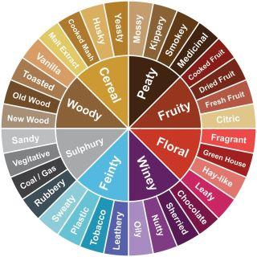
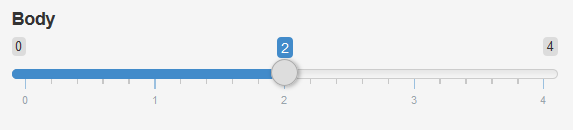
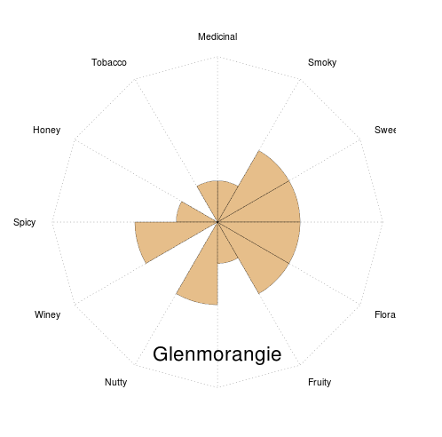

## Whisky Flavours

Whisky is a very complex compositions of different flavours. These flavours range from fruity, floral, woody to peaty and winey. The diagram below shows 8 main categories.



The Whisky Advisor makes a suggestion that best fits your favorites flavours.

--- .class #id 


## The Dataset

The dataset that I use is a set of 86 whiskies that have been classified in 12 variables. More than the 8 shown in the previous slide.

```
## 'data.frame':	86 obs. of  17 variables:
##  $ RowID     : int  1 2 3 4 5 6 7 8 9 10 ...
##  $ Distillery: Factor w/ 86 levels "Aberfeldy","Aberlour",..: 1 2 3 4 5 6 7 8 9 10 ...
##  $ Body      : int  2 3 1 4 2 2 0 2 2 2 ...
##  $ Sweetness : int  2 3 3 1 2 3 2 3 2 3 ...
##  $ Smoky     : int  2 1 2 4 2 1 0 1 1 2 ...
##  $ Medicinal : int  0 0 0 4 0 1 0 0 0 1 ...
##  $ Tobacco   : int  0 0 0 0 0 0 0 0 0 0 ...
##  $ Honey     : int  2 4 2 0 1 1 1 2 1 0 ...
##  $ Spicy     : int  1 3 0 2 1 1 1 1 0 2 ...
##  $ Winey     : int  2 2 0 0 1 1 0 2 0 0 ...
##  $ Nutty     : int  2 2 2 1 2 0 2 2 2 2 ...
##  $ Malty     : int  2 3 2 2 3 1 2 2 2 1 ...
##  $ Fruity    : int  2 3 3 1 1 1 3 2 2 2 ...
##  $ Floral    : int  2 2 2 0 1 2 3 1 2 1 ...
##  $ Postcode  : Factor w/ 85 levels " \tAB38 7RE",..: 19 4 5 16 6 68 54 8 7 12 ...
##  $ Latitude  : int  286580 326340 352960 141560 355350 194050 247670 340754 340754 270820 ...
##  $ Longitude : num  749680 842570 839320 646220 829140 ...
```

```
## NULL
```

This dataset is readily avaible on the internet and has been used in several other data analyses.

--- .class #id 

## Entering your preference

As we saw in the previous slide, there are 12 variables - Body, Sweetness to Fruity, Floral - each of which as a value in the range of 0 to 4.

The Whisky Advisor has 12 sliders on the left side, one for each of the variables.



You can make your choice by sliding to the desired value.

When you are done, press the "Advise!"-button.

--- .class #id 

## Showing the results

The preference entered on the left side is matched with the data in the whisky dataset. For each variable the absolute distance is calculated. The top three whiskies that are closest are shown, together with a spider chart. 




